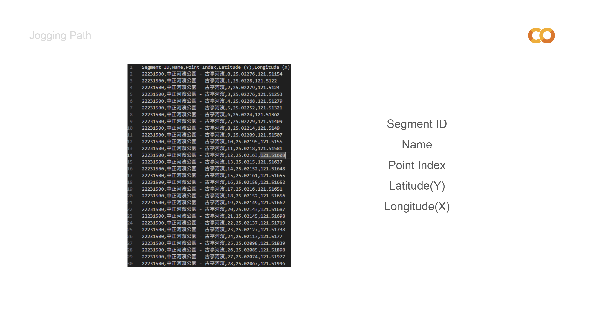

# *Surface Temperature of Jogging Path*
#### *JIN WEI KUAN*
---
---
## Reference
https://developers.strava.com/docs/reference/#api-SegmentEfforts
https://earthexplorer.usgs.gov/  
https://www.qgistutorials.com/en/docs/3/multi_criteria_overlay.html
## 1. Concept
此次STUDIO將透過database的真實環境數據去分析研究我想探討的議題，透過衛星遙測地表的溫度，都市鋪面與行道樹的分布以及真實大眾慢跑路徑的紀錄，去分析慢跑路徑大致的地表體感舒適度。

## 2. Structure

## 3. PROCESS
### (1) DATA COLLECTION
#### *JOGGING PATH* 
##### ACCESS TOKEN


首先，我從STRAVA API取得慢跑路徑的資料，經過一番搜索後，比較可惜的是只能取得路徑的地理資訊，無法取得跟個人有關的任何資料，像是甚麼時間跑的等等。要向STRAVA API索取資訊，首先需要ACCESS TOKEN，必須先註冊STAVA的會員，設定好自己的API應用程式後，得到client id，透過同意授權相關資料後，會得到一組code，回傳至設定好的POSTMAN裡，就可以開始搜尋STRAVA上的慢跑資訊。

---

##### SEGMENT
 ```python
!pip install polyline  # 確保安裝 polyline

import requests
import polyline
import csv
from math import cos, radians
from google.colab import files

# 配置
ACCESS_TOKEN = "<YOUR_ACCESS_TOKEN>"  # 替換為你的 Strava Access Token
BASE_URL_EXPLORE = "https://www.strava.com/api/v3/segments/explore"
BASE_URL_SEGMENT = "https://www.strava.com/api/v3/segments/{id}"

# 台北小巨蛋中心座標
CENTER_LAT, CENTER_LON = 25.0514, 121.5511
RADIUS_KM = 4  # 半徑 4 公里

# 計算緯度與經度步長
LAT_DELTA = 1.5 / 111  # 緯度每步長 1.5 公里
LON_DELTA = 1.5 / (111 * cos(radians(CENTER_LAT)))  # 經度需考慮緯度縮放

# 計算初始範圍
lat_min, lon_min = CENTER_LAT - RADIUS_KM / 111, CENTER_LON - RADIUS_KM / (111 * cos(radians(CENTER_LAT)))
lat_max, lon_max = CENTER_LAT + RADIUS_KM / 111, CENTER_LON + RADIUS_KM / (111 * cos(radians(CENTER_LAT)))

# 初始化結果
segments_with_points = {}

# 分塊搜尋
lat = lat_min
while lat < lat_max:
    lon = lon_min
    while lon < lon_max:
        # 計算子區域邊界
        sub_bounds = f"{lat},{lon},{lat + LAT_DELTA},{lon + LON_DELTA}"

        # 發送請求
        response = requests.get(BASE_URL_EXPLORE, params={
            "bounds": sub_bounds,
            "access_token": ACCESS_TOKEN
        })

        if response.status_code == 200:
            sub_segments = response.json().get("segments", [])
            for segment in sub_segments:
                segment_id = segment["id"]

                # 避免重複請求已處理過的 Segment
                if segment_id not in segments_with_points:
                    # 獲取每段 Segment 詳細資訊
                    segment_response = requests.get(BASE_URL_SEGMENT.format(id=segment_id), params={
                        "access_token": ACCESS_TOKEN
                    })

                    if segment_response.status_code == 200:
                        segment_data = segment_response.json()
                        polyline_encoded = segment_data.get("map", {}).get("polyline", "")

                        if polyline_encoded:
                            points = polyline.decode(polyline_encoded)
                            segments_with_points[segment_id] = {
                                "name": segment_data["name"],
                                "points": points
                            }

        lon += LON_DELTA
    lat += LAT_DELTA

# 設定檔案名為當前工作目錄
output_file = "segments_with_points.csv"

# 將資料寫入 CSV 檔案
try:
    with open(output_file, mode="w", newline="", encoding="utf-8") as csvfile:
        writer = csv.writer(csvfile)
        # 寫入標題行
        writer.writerow(["Segment ID", "Name", "Point Index", "Latitude (Y)", "Longitude (X)"])

        # 寫入每個 Segment 的資料
        for segment_id, segment in segments_with_points.items():
            for idx, (lat, lon) in enumerate(segment["points"]):
                writer.writerow([segment_id, segment["name"], idx, lat, lon])

    print(f"Total Segments with Points: {len(segments_with_points)}")
    print(f"Data saved to {output_file}")

    # 自動下載 CSV 檔案
    files.download(output_file)

except Exception as e:
    print(f"Error saving file: {e}")

```





因為我一次想要抓取大量的SEGMENT(慢跑路徑點位)，所以我使用GOOGLE CLAB幫我抓取以中心點半徑3公里範圍內的慢跑資料，然而後來我發現可能是經緯度換算的單位不夠精細，所以熱門路線需要透過自己將他們加入最愛路線，再透過starred segment去抓取。剛開始得到的每條路徑會是各自的一串路徑編碼，需要解碼才能將他們應用至QGIS上，然而QGIS需要整理好的CSV檔，因此在整串程式碼的最後，我將所有路徑的ID、點位順序以及經緯度都按照順序整理成CSV。將CSV匯入QGIS後，會用到REPROJECT LAYER、POINTS TO PATH、BUFFER、VECTOR TO RASTER(參考Pavement & Trees)等等的整理動作，以利後續計算綜合地表溫度圖的進行。

---

#### *Surface Temperature*
##### LST 


接下來要取得遙測地表溫度圖LST，我利用USGS EXPLORER提供的資訊去得到LST，其中的時間範圍與地理位置範圍可以自己決定，需要注意的是盡量選取雲層覆蓋較少的圖去作使用可以減少誤差。接著下載下來的圖還需要經過一層計算才能視覺化成我們常使用的溫度圖，這時可以使用QGIS裡的SCP插件，幫助快速得出我們需要的溫度圖。

---

##### Pavement & Trees


從前一個步驟得到的地表溫度圖並不包含有街道尺度的精確度，因此在這裡加入鋪面因素與行道樹的分布，能夠更加真實的呈現地表溫度狀態，而這些數據可以從政府的公開數據去取得。將得到的鋪面與行道樹分布資訊匯入QGIS後，要將他們轉換成RASTER，並檢查他們是CRS是否相同。 
-人行道(臺北市人行道固定設施物_人行道範圍圖)
https://data.taipei/dataset/detail?id=715d3a83-8445-4496-b6bf-b0900538b7e7  
-馬路-瀝青(臺北市道路銑鋪區塊圖資)
https://data.gov.tw/dataset/169645   
-公園-綠地
https://overpass-turbo.eu/  
-透水鋪面
https://data.gov.tw/dataset/166231  
-人行道樹分布圖
https://data.gov.tw/dataset/166231

---

### (2) Calculate


將所有所有轉換成RASTER的LST、人行道分布圖、行道樹分布圖、透水鋪面、公園綠地進行加權計算。

---

### (3) Disccusions

 ```python
 import pandas as pd
import matplotlib.pyplot as plt
import seaborn as sns

# 修正檔案路徑
file_path = r"D:\大五\建築設計(八)\dataset\layout\圖表\資料\給chatgpt.xlsx"

# 讀取資料
data = pd.read_excel(file_path)

# 將資料轉換為適合繪圖的格式
data_melted = data.melt(id_vars=['空間類型'], var_name='月份', value_name='溫度')

# 創建散布圖，點樣式改為 'x'，並設定解析度為300dpi
plt.figure(figsize=(12, 6), dpi=300)
sns.scatterplot(data=data_melted, x='月份', y='溫度', hue='空間類型', style='空間類型',
                markers='x', palette='Set2', s=100)

# 修改 x 軸標籤為數字
unique_months = sorted(data_melted['月份'].unique())
plt.xticks(ticks=unique_months, labels=[int(month.replace('月', '')) for month in unique_months])

# 添加標題和標籤
plt.title('不同空間類型在各月份的溫度散布圖', fontsize=16)
plt.xlabel('月份', fontsize=12)
plt.ylabel('溫度 (°C)', fontsize=12)
plt.legend(title='空間類型', fontsize=10, title_fontsize=12)
plt.grid(axis='y', linestyle='--', alpha=0.7)

# 顯示圖表
plt.tight_layout()
plt.show()
```


透過STRAVA API得到的慢跑路徑地理資訊，大致可以分成運動場、都市公園廣場、都市跨街人行道、河岸山地等等四個空間模式，以這四種空間模式去計算四個月份的綜合底表溫度圖，並將這四種空間模式的各月份溫度透過GIS去做平均溫度圖的計算。

---

```python
import pandas as pd
import matplotlib.pyplot as plt
import seaborn as sns

# 设置数据路径
data_path = r"D:\大五\建築設計(八)\dataset\layout\圖表\資料\都市單車路徑點位溫度.xlsx"

# 读取数据，假设有效数据从第三行开始
data = pd.read_excel(data_path, header=0)

# 数据转置以方便提取每个点位的数据
data_transposed = data.transpose()
data_transposed.columns = data_transposed.iloc[0]  # 使用数据的第一行作为列标题
data_transposed = data_transposed.drop(data_transposed.index[0])

# 将列标题中的 Segment ID 和 Point Index 提取出来
data_transposed.reset_index(inplace=True)
data_transposed[['Segment ID', 'Point Index']] = data_transposed['index'].str.extract(r'(\d+)\.(\d+)')
data_transposed.drop('index', axis=1, inplace=True)

# 将提取出来的 Segment ID 和 Point Index 转换为数字
data_transposed['Segment ID'] = pd.to_numeric(data_transposed['Segment ID'], errors='coerce')
data_transposed['Point Index'] = pd.to_numeric(data_transposed['Point Index'], errors='coerce')

# 处理 NaN 值
data_transposed.dropna(subset=['Segment ID', 'Point Index'], inplace=True)

# 分组绘图
segment_ids = data_transposed['Segment ID'].unique()
segments_per_plot = 4  # 每个图显示 4 个 Segment ID
num_plots = len(segment_ids) // segments_per_plot + (len(segment_ids) % segments_per_plot > 0)

for i in range(num_plots):
    fig, axes = plt.subplots(nrows=segments_per_plot, figsize=(40, 5 * segments_per_plot))
    for ax, segment_id in zip(axes, segment_ids[i*segments_per_plot:(i+1)*segments_per_plot]):
        segment_data = data_transposed[data_transposed['Segment ID'] == segment_id]
        sns.lineplot(ax=ax, x='Point Index', y='March', data=segment_data, marker='o', label='March', color='blue')
        sns.lineplot(ax=ax, x='Point Index', y='July', data=segment_data, marker='o', label='July', color='red')
        sns.lineplot(ax=ax, x='Point Index', y='September', data=segment_data, marker='o', label='September', color='green')
        sns.lineplot(ax=ax, x='Point Index', y='December', data=segment_data, marker='o', label='December', color='purple')
        print(segment_data)
        s = segment_data.to_numpy()
        for j in range(1, len(s)):
            should_mark = False
            max_y = 0
            for k in range(3, 7):
                max_y = max(max_y, s[j][k])
                if abs(s[j][k] - s[j - 1][k]) > 2:
                    should_mark = True
            if should_mark:
                ax.annotate(str(int(s[j][0])), (s[j][0], max_y + 1))
        
        ax.legend()
    plt.tight_layout()
    plt.show()
```


從STRAVA API得到的馬拉松路徑點位溫度圖，將其整理成折線圖表，以Y軸為溫度，X軸為每條馬拉松路徑點位的點位順序，顏色區分為四個月份去作分析，其中標記出相鄰點位溫度差距超過2°C以上的點位經緯度，以GIS的視覺化月份溫度分布圖，研究空間環境發生了何種變化導致溫度改變的發生，並思考路徑是否需要作出規畫改善。